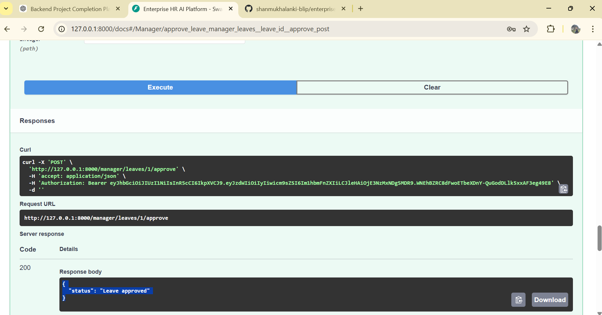

# Enterprise HR AI Platform


Enterprise HR AI Platform is a **full-stack HR management system** built with **FastAPI and React**.
It provides secure authentication, role-based access control, leave management workflows, and an AI-powered HR assistant.

This project demonstrates **production-style backend architecture**, API security, and containerized deployment.

---

## 🚀 Features

* 🔐 **JWT Authentication**
* 👥 **Role-Based Access Control** (Employee / Manager)
* 📝 **Leave Request Workflow**
* ✔ **Manager Leave Approval System**
* 🤖 **AI HR Chat Assistant**
* 🐳 **Dockerized Deployment**
* ⚡ **FastAPI High-Performance Backend**
* 💻 **React Frontend (Vite)**

---

## 🏗 Architecture

```text
                +----------------------+
                |      React UI        |
                |   (Vite Frontend)    |
                +----------+-----------+
                           |
                           | HTTP API
                           v
                +----------------------+
                |     FastAPI Server   |
                |   (Backend API)      |
                +----------+-----------+
                           |
        +------------------+------------------+
        |                                     |
        v                                     v
+-------------------+               +-------------------+
|   Auth Service    |               |   Leave Service   |
|  JWT Authentication|               | Leave Management  |
+-------------------+               +-------------------+
        |                                     |
        +------------------+------------------+
                           |
                           v
                +----------------------+
                |   SQLAlchemy ORM     |
                +----------+-----------+
                           |
                           v
                +----------------------+
                |     SQLite DB        |
                |   Employee / Leave   |
                +----------------------+

---

## 📂 Project Structure

```
enterprise-hr-ai-platform
│
├── app
│   ├── api
│   │   ├── auth.py
│   │   ├── chat.py
│   │   ├── leave.py
│   │   └── manager.py
│   │
│   ├── core
│   │   ├── auth.py
│   │   └── logging.py
│   │
│   ├── db
│   │   ├── database.py
│   │   └── models.py
│
├── hr-ui              # React frontend
│
├── docker-compose.yml
├── Dockerfile
├── requirements.txt
└── seed_db.py
```

---

## ⚙️ Installation

### 1️⃣ Clone the repository

```
git clone https://github.com/shanmukhalanki-blip/enterprise-hr-ai-platform.git
cd enterprise-hr-ai-platform
```

---

### 2️⃣ Create virtual environment

```
python -m venv venv
```

Activate:

Windows

```
venv\Scripts\activate
```

Mac/Linux

```
source venv/bin/activate
```

---

### 3️⃣ Install dependencies

```
pip install -r requirements.txt
```

---

### 4️⃣ Initialize database

```
python seed_db.py
```

This creates default users:

```
employee@test.com
password: 123456
```

```
manager@test.com
password: 123456
```

---

### 5️⃣ Start backend server

```
uvicorn app.main:app --reload
```

Swagger API docs:

```
http://127.0.0.1:8000/docs
```

---

## 🐳 Run with Docker

```
docker-compose up --build
```

This starts:

* FastAPI backend
* React frontend
* Database services

---

## 🔐 Authentication Flow

1. User logs in using `/auth/login`
2. Server returns **JWT access token**
3. Token is used to access protected APIs
4. Role guards enforce **Employee / Manager permissions**

Example:

```
Authorization: Bearer <access_token>
```

---

## 📡 API Endpoints

### Auth

```
POST /auth/login
POST /auth/logout
```

### Chat

```
POST /chat
```

### Leave

```
POST /leave/request
GET /leave/my-leaves
```

### Manager

```
GET /manager/leaves
POST /manager/leaves/{leave_id}/approve
```

---

## 🧠 AI HR Assistant

Employees can interact with an AI assistant to:

* Ask HR policy questions
* Check leave status
* Get company information

---

## 📸 Demo

Add screenshots here once available:

* Swagger API
* Leave approval workflow
* HR chat interface

---

## 🛠 Tech Stack

Backend

* FastAPI
* SQLAlchemy
* JWT Authentication

Frontend

* React
* Vite

Infrastructure

* Docker
* Docker Compose

---

## 🎯 Learning Goals

This project demonstrates:

* Production-style FastAPI architecture
* JWT authentication and authorization
* Modular API design
* Role-based access control
* Full-stack integration
* Containerized deployment

---

## 📄
## 📸 Screenshots

### API Documentation


### Leave Approval Workflow


### HR Chat Assistant


